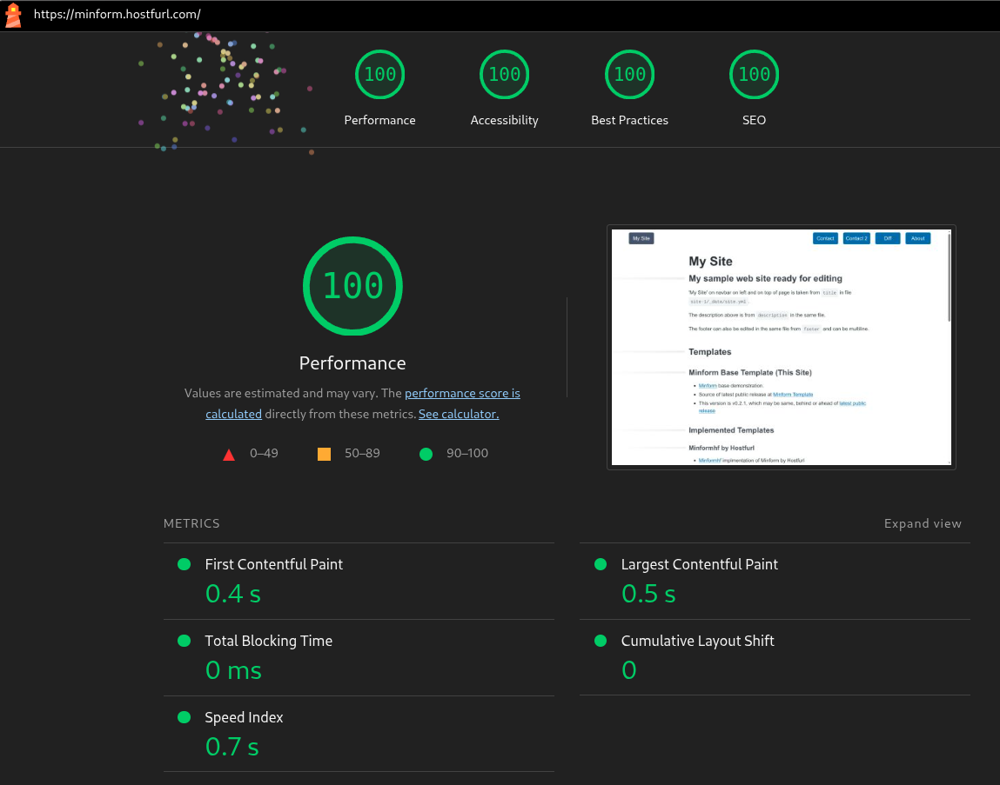

# Minform

## Website template starter with markdown and minimalist forms

A very minimalist approach to adding in forms templating to a website starter template that supports markdown.

Provides examples of website template based on markdown and forms for easy automation of form building, using a simple and direct approach that avoids complex tooling and plumbing.

Minform is a public website template using [11ty](https://11ty.dev) static website generator.

Minform is open source with a permissive license. 

Minform is a public web template built on  [Build Awesome Starter](https://github.com/anydigital/build-awesome-starter) version [v0.8.1](https://github.com/anydigital/build-awesome-starter/releases/tag/v0.8.1) with the following additions:

## Added

The main addition is a minimalist approach to adding template based forms using two different approaches

- A simpler form addition approach, easier for beginners, that requires attention to reset variable names that are reused.
- A more abstract form addition approach that uses rendering as soon as convenient and can reuse variable names without reset. This approach is suitable for further adaptation.
- A minimal implementation of a navigation bar
- Minimal CSS additions to support above
- Small number of filters and shortcodes added
- [htmx](https://htmx.org/) added to simplify templating with only 200 OK server status response handled
- A cors server can be specified for use in developer mode only as well as in production mode. If cors is used then a server must be configured to handle cors requests.

No state or login information used.

Using htmx, a backend server is expected to handle standard POST requests and return a simple HTML response for display in a `
` of the same page by htmx. The page is not replaced.

## Usage

This is a base template intended for adaptation as a template implementation.

This base template is online at at https://minform.hostfurl.com

There is an example of an adaptation as a template implementation at https://minformhf.hostfurl.com.

To view in a development environment:

- Clone repository or download a release
- `npm install`
- `npm start`
- Browse to link

## Updates

- `npm update` updates packages, but does not automatically update parallel `_includes_minform/blades` if blades updated.
- `npm run syncblades` will copy and automatically edit updated relevant blades templates from `_includes/blades` used in parallel directory `_includes_minform/blades`. A shorter way is to run `npm i`.

## Prerequesites

Basically node/npm for a non root user with `/bin/sh` pre-installed.

If you have command interpreter `/bin/sh`  (or symbolic link to), then `npm` from `node` will use this for POSIX shell operations.

A POSIX compliant shell and file system for use with `npm run` that includes support for `ln` and `rm` is required.

So, any desktop OS with a Linux kernel, macOS, Windows with WSL, any mobile or tablet OS with app which supports a POSIX compliant shell, any embedded system with Busybox and a way to install packages, such as with `curl` and piping to `sh`. Further information to be provided.

What is not supported is Windows using `cmd` for `npm run`. Install WSL if using Windows.

It is expected to use `rsync` for uploading files. Normally this is pre installed.

While `git` is not required, it is expected for advanced use.

Never install and run node/npm for user root. This may not be practical for embedded systems.

## Configuration

A simple approach for a backend is to take the form information and send it as an email to a server administrator, such as for a simple contact form or subscribe/unsubscribe form.

Developers are expected to use browser developer console and server logs to view server errors during development.

Additional site.yml file variables:
- `corsprod`, set true to uses cors in production, default`false, no quote around true or false
- `corsurl` set to server url if using cors with localhost development, such as `corsurl: https://example.com`
- `formpath`: is the 'script path' and must be set for static sites, such as `formpath: /cgi-bin/minform.cgi`

For localhost development it is common to set `corsurl`. However the cors server must allow cors.

## The two approaches for using forms

The two approaches that can be used for building forms with Minform are:

- A simplified abstraction that is easy for beginners to follow. This approach requires reused variables to be kept clean by resetting after use. Shown in `contact.md`

- An example that shows more complex abstraction with convenient potential for more abstraction. This approach dramatically reduces number of variable names that need to be reset after use, by using rendering as soon as convenient. Shown in `contact2.md`.

For the first simpler approach above, it is easy to override or overwrite the configuration values above on a page by page or even within a page. If overwritten, either values should be set each time or old values should be preserved and used to reset site.yaml values. A useful concept is variables to be reused should be kept clean by resetting after use. This approach is shown code for `forms/contact.liquid` as variable names are reused.

For the second more abstract approach, these values can be overridden in frontmatter settings, as shown, and do not overwrite site.yaml values.

## CSS and Performance

The current version includes a maintained [Pico CSS](https://blades.ninja/css/pico/), [CSS blades](https://blades.ninja/css/) and does not inline CSS.

The combination of not inling CSS, using CSS files, caching CSS files, and cache busting hosted CSS files, results in great performance, efficiency and simplicity.

However this arrangement risks penalty by web page quality rankers, such as Lighthouse, which may take a few percentage points off performance result for a barely noticeble effect for a first site view (before cache becomes invalid again).

4x100 Lighthouse score from a desktop PC in Australia to https://minform.hostfurl.com v0.2.2 hosted in Europe on 5 April 2026:

Performance 100, Accessibility 100, Best Practices 100, SEO 100.

We may offer an additonal CSS solution in the future. However it is unlikely we will offer a utility-first CSS template example, which although reduces the size of CSS files, is bewildering for the inexperienced and expands size of individual pages.

## Background

There is no need to use a traditional script path showing an apparent directory and apparent script file for `formpath`. This naming style is used in the example for compatibility with many usage examples that expect a CGI specification, which is increasingly uncommon, not necessary and not recommended.

Examples should be provided of various backend server approaches, including scipt CGI, Node Express, various Node frameworks, PHP, Python, Perl PSGI direct, Perl PSGI framework, Perl CGI, FastCGI. Also, examples of configuration for Nginx should be provided for both FastCGI and reverse proxy.

For example, the Perl PSGI specification is flexible enough to allow an app to appear to be a CGI app when it is not, using traditional CGI, using FastCGI as an intermediary or using reverse proxy to a persistent PSGI process. Hence a PSGI app can work work as a CGI script even though it is written as a PSGI persistent app.

While Nginx cannot launch CGI scripts, Nginx can interface to persistent processes using a pool of FastCGI processes. A FastCGI process can itself launch self terminating CGI scripts.

`mod_perl` for Apache allows use of persistent Perl processes. However it should be kept in mind that each web request to Apache launches a new Apache thread.

### A note on web server to back end server handling differences:

- CGI: A separate process is launched for each web request with communication by standard input/output/error and with process start up environment variables injected by web server. Not CPU efficient. Does not consume memory when not in use.
- FastCGI: A persistent process is launched with communication by network, socket or named pipes. What would have been CGI environment variables are now passed though IPC agreed variables. A common approach for PHP with Nginx. CPU efficient. Consumes memory when not in use.
- Reverse Proxy: a persistent process with communication by network or socket without extra environment variables after launch or additional IPC protocols. Additional variables passed through as injected http headers. A common approach for docker and other containers, and for node servers, to avoid directly facing public Internet by letting the web server handle TLS, caching, DNS name use and port remapping.
