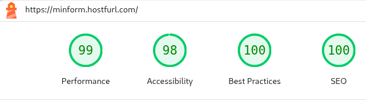

# Minform

## Website template starter with markdown and minimalist forms

A very minimalist approach to adding in forms templating to a website starter template that supports markdown.

Provides examples of website template based on markdown and forms for easy automation of form building, using a simple and direct approach that avoids complex tooling and plumbing.

Minform is a public website template using [11ty](https://11ty.dev) static website generator.

Minform is open source with a permissive license.

Minform is a public web template built on  [Build Awesome Starter](https://github.com/anydigital/build-awesome-starter) version [v0.8.1](https://github.com/anydigital/build-awesome-starter/releases/tag/v0.8.1)

## Developer UX Philosophy

Promote developer UX (user experience) escape hatches to frustrating static web site development. Allow simple forms to email. Detailed information below.

## Added

Blog features and a minimalist approach to adding template based forms using two different approaches

- A simpler form addition approach, easier for beginners, that requires attention to reset variable names that are reused.
- A more abstract form addition approach that uses rendering as soon as convenient and can reuse variable names without reset. This approach is suitable for further adaptation.
- A minimal implementation of a navigation bar
- Minimal CSS additions to support above
- Small number of filters and shortcodes added
- [htmx](https://htmx.org/) added to simplify templating with only 200 OK server status response handled
- Option not to use htmx to work with traditional form submission sites without problems.
- A cors server can be specified for use in developer mode only as well as in production mode. If cors is used then a server must be configured to handle cors requests.

No state or login information used.

Using htmx, a backend server is expected to handle standard POST requests and return a simple HTML response for display in a `<div>` of the same page by htmx. The page is not replaced.

Using similar techniques as [anyblades/subtle](https://github.com/anyblades/subtle), the sample starter blog pages from [eleventy-base-blog](https://github.com/11ty/eleventy-base-blog) have been included in `/blog` and some additions made. In addition code from [eleventy-base-blog](https://github.com/11ty/eleventy-base-blog) used and adapted.

## Blog Features

- Markdown based for easy editing
- One or more tags can be specified in front matter (see examples)
- There is an automatically generated separate page to list all tags
- There are automatically generated separate pages for each individual tag with links to blog entries
- There is an automatically generated set of Blog index pages that are linked
- Edit `size` in frontmatter of `content/blog.njk` to change maximum number of blogs indexed in each index page
- Each blog entry has previous and next links, based on date order
- The date can be altered in front matter to change its order in the index
- Image files can be remote links and also uploaded to same directory as markdown file
- Uploaded image files are processed when not in _public directory
- `draft : true` in front matter will exclude draft from production build. It is good idea to add a draft tag to quickly find drafts.
 
 
## The Conditions the Developer UX Philosophy Escapes From

Escape from frustratingly sluggish web site development where there is high lag or poor network conditions, such as from high lag [Tyranny of Distance](https://en.wikipedia.org/wiki/The_Tyranny_of_Distance_(book)), or from congested and intermittent mobile networks during rush hours, using a mobile phone.

Escapes include point and click or touch based solutions for the less technically oriented, that work well on small screens such as tablets and mobile phones.

## The Escapes

Three escapes are described, a shell escape and two web browser based escapes.

### Shell Escape

#### Highly Efficient Shell Based Escapes that Work on a Tablet

This technically practical approach is the fastest, most efficient and technically capable approach with superb capability at fixing issues. Works well on tablets but not so well on mobile phones.

Use a shell with git and npm and only upload incremental changes to a web server with command aliases. A very common approach for professionals. CI/CD is optional for a one step approach that only requires a git server to be updated,

Requires substantial practice to get efficient at and looks messy to the inexperienced who are accustomed to point and click approaches.

Can fix up issues arising from approaches below. 

### Escapes that still allow Point and Click or Touch, when CI/CD is included

Web pages are loaded into a web browser for local editing.

The key is including CI/CD (Continuous Integration/Continuous Deployment or Delivery). 

While setting up CI/CD is involved, CI/CD can be provisioned automatically for a git server with APIs and so integrated into admin services.

These approaches can lead to difficult to fix messes. Such messes are best efficiently fixed with shell approach above by those who are experienced.

#### Edit entire page locally in browser escape using Git server UI that works on a tablet

For those who do not feel intimidated by an approach with some technicality, the git server UI approach is available. Navigation can appear complex. This approach is not ideal, particularly when messes result, and in no way matches the efficiency and speed of the shell based approach to fix messes. It can help solve problems with the next CMS approach, such as uploading multiple image files.

Very practical for web pages using Markdown.

Web pages and web page edits are stored locally as text in a browser, with preview available. Very snappy once loaded. Point and click navigation can appear complex, be sluggish and re loading of pages for editing can also be sluggish.

This approach can solve issues with the next approach, such as uploading multiple image files.

#### Edit entire page locally in browser escape using specialised CMS that works on a tablet or phone and hides complexity

With [Sveltia CMS](https://sveltiacms.app/), git server web pages that are part of a collection are downloaded and stored in the local browser cache, along with edits, delaying the need to save changed pages immediately. 

The key is a SPA (single web page app) that also includes CI/CD on a git server backend. Navigation and editing is simple point and click or touch. With CI/CD the git server itself can rebuild the web site and deploy it.

Very practical for web pages using Markdown.

Both the navigation and page editing experience is very snappy as it is all local. Clicking on a save button uploads changed file through the servers API (entire file is uploaded, not just changes) and if CI/CD is configured, includes the changes on the web site without any further action.

A nice way for anyone to make minor edits to a web site on a tablet or mobile phone during rush hours with varying mobile signal quality and congestion.

While not as efficient as the shell based approach, it is still an enormous improvement to 'online editing' in high latency or poor network environments.

## How can external users or access be added to edit repository on a Git server, including for Sveltia CMS?

**TLDR:** Sveltia CMS allows UI logon as collaborator. Access Tokens, intended for automated API use, not for UI use, can also be used. While Access tokens can also be used at the command line level, SSH keys are a better solution at the command line level.

### Local file access to repository

None of the following applies for direct local file access to a distributed Git repository, which is the primary and core use of Git.

### Logon and Access methods to repository on a Git Server

There are three ways to access a repository on a Git server, depending on interface:

| Repository Server Interface | Preferred Access Method |
| :----- | :----------- |
| UI | Password / Passkey / External server |
| Command line | SSH key <sup>1</sup> |
| Automated API | Access Token |

1\. Access Tokens can be used for command line access but it is not ideal.

If the external user has a user account on same Git server then an external user can be added in as a write or admin level collaborator to a specific repository. In this case it is up to the external user to manage their own repository access with UI (regular login as themselves) or command line (SSH key). For Sveltia CMS UI, they can use a regular UI logon as themselves but not a SSH key for such UI access.

### Sveltia UI Logon Methods to repository on a Git Server

- Password / Passkey
- Access Token

If an external user has no user access account, or if they are not granted collaborator access, then an access token can be provided for Sveltia CMS UI to get read/write access to the repository at an API level. This is not ideal, is not an intended use of Access Tokens, and is not as convenient or as secure as using a regular UI login. For example, the Access Token needs to be pasted into the login UI of Sveltia CMS.

Further information in next section.

## Relevant features of GitHub and Forgejo Git Servers for CMS CI/CD use

|       | Forgejo | GitHub  |
| :----- | :-----------: | :---: |
| GitHub Compatible Actions |  ✅ | ✅  |
| Command line access by SSH Key/Access Token only  | ✅  | ✅ |
| Access Tokens for write to only specified repositories |  ✅ | ❌  |
| Sveltia CMS edit with Access Token | ✅ | ✅ |
| Sveltia CMS edit with UI logon - no external server <sup>1</sup> | ✅ | ❌ |
| Sveltia CMS edit with UI logon - with external server <sup>2</sup>| ✅  | ✅ |
| Git services range  | 5/5 | 5/5 |
| UI usability <sup>3</sup> | 5/5 | 5/5 |
| UI feature range compared to GitHub |  3/5 | 5/5  |
| Delete non empty directory with UI <sup>4</sup> | ❌  | ✅ |
| REST API |  ✅ | ✅  |
| GraphQL API <sup>5</sup> | ❌  | ✅ |
| Open Source | ✅ | ❌ |
| Self Hosting  |  Free  | Subscription |

1\. GitHub currently does not allow OAuth 2.0 Authentication Codes to be converted to OAuth 2.0 Access Token with client secret. Must be done externally instead using client secret.  
2\. Netlify is commonly used for GitHub with Sveltia CMS. A node express app with npm package simple-oauth2 can be used.  Not required with Forgejo.  
3\. UI usability is not the same as ease of use of UI for the inexperienced: there is nothing easy about starting with Git and Git Servers for the inexperienced at either the command line or UI level. It should be kept in mind that Git is first and foremost a command line tool for un-intuitive, fast, efficient, local distributed (non centralised) directory content tracking (including versioning) by building on 'dumb' de-duplicate file content addressing. Git servers provide enhancements that are not a core part of Git. There is no point in complaining about how un-intuitive git and command names used are: experienced git users live in the command line and are infamous for not caring about or reacting to rants. From their perspective, complaints and rants miss the point and are irrelevant. The effort required to gain a useful working knowledge is far more than the effort required to overcome confusion about command names viewed as un-intuitive due to what is incorrectly imagined how Git works. Why should two decades of non theoretical practice oriented, efficient, successful, practices to make effective use of a well hidden, with notorious plumbing, un-intuitive methods, that was a tremendous improvement on prior methods, and was originally a side project written with bash scripts to solve an enormous public legal row, be cosmetically changed to suit ranters? Automatic provisioning with APIs, such as automated CMS CI/CD provisioning, is a huge help to bypass complexity. Sveltia CMS uses Git server APIs within the browser, so it is natural to also add API automated provisioning at a hosting provider level to help and to hide complexity.  
4\. Practical use point. There is a held up pull request to enable this in Forgejo.  Best solution is command line deletion of directory. Otherwise turn off Actions, delete files one by one, then directory, then turn on Actions again.  
5\. With GraphQL, API all files can be downloaded from CMS specified collections to local browser cache with a single API call.  

## Migration to Forgejo Git Server warning

If you migrate this repository to a Forgejo Git server then it will attempt to start a Forgejo Action. Public examples of Forgejo servers are https://codeberg.org/ and https://codefloe.com/

There is a mechanism to place in place to stop the Forgejo Action early. Forgejo Actions should be disabled following migration until further setup.

## Usage

This is a base template intended for adaptation as a template implementation.

This base template is online at at https://minform.hostfurl.com

There is an example of an adaptation as a template implementation at https://minformhf.hostfurl.com.

To view in a development environment:

- Clone repository or download a release
- `npm install`
- `npm start`
- Browse to link
- If using CMS CI/CD, please see `.env.sample` and make sure any `.env` file is included in `.gitignore`. While the information is not really secret, it is good practice and will avoid getting automated warnings. 

## Updates

- `npm update --save` updates packages

## Prerequesites

Basically node/npm for a non root user with `sh` or symbolic link from `sh`, pre-installed.

If you have command interpreter `sh` in `$PATH`, then the `npm run` script will use this for POSIX shell operations.

What is required is a POSIX compliant shell and file system for use with `npm run` that includes support for `ln` and `rm`.

So, any desktop/laptop/server OS with a Linux, BSD or UNIX like kernel, including macOS; Windows with WSL; any mobile or tablet OS with app which supports a POSIX compliant shell; any embedded system with BusyBox.

Just about any system with `curl` and `sh` can install node/npm, as shown below.

What is not supported is Windows using `cmd` for `npm run`. Install WSL if using Windows.

It is expected to use `rsync` for uploading files. Normally this is pre installed.

While `git` is not required, it is expected for advanced use.

Never install and run node/npm for user root. This may not be practical for embedded systems.

### OS independent installation of node/npm

There are a variety of methods supported by OS distributions and version software.

A cross platform, OS independent, method to install up to date node/npm is to use curl and sh such as documented at [Download Node.js®](https://nodejs.org/en/download), which downloads and installs node with npm bundled.

### Installation of node/npm on Termux for Android

Termux emulates a Debian distribution on Android. A standard installation of a desktop or server OS will include prerequisites such as curl and git.

With a fresh Termux installation on Android:

```
pkg update
pkg upgrade
pkg install curl git -y
```

Either use
```
pkg install nodejs-lts -y
```
or, to help keep more up to date versions of node, use [Download Node.js®](https://nodejs.org/en/download)

### Technical Details for `ln`, `rm` and other POSIX script commands

So why not replace symbolic link script command `ln` and `rm` with `node.fs` equivalents?

1. If a file system does not already support POSIX style symbolic links then `node.fs` won't either.
1. Being able to run plain POSIX shell scripts through binary `sh` is a practical convenience.
1. It is normal practice in node to run a variety of binaries with `npm run`, not just `sh`.

Except for node as binary itself, all node/npm software runs as a script of node binary itself and npm software itself is a set of node scripts. The 'npm run' command is a node npm script that further uses `sh` as shell for additional script commands through `child_process.exec`. The shell can be bypassed through `child_process.execFile()`.

`npx`, which is installed with npm, is also a set of node scripts to load and run binaries without installing them first with `npm`.

Typically a node script will have `#!/usr/bin/env node` as first line. 

Typically, in a non server user shell, node executes as a shell launched binary to run npm and other node scripts. Hence, the node launched `npm run` script further uses sh to launch and execute POSIX scripts.

On Debian this will find `/usr/bin/sh`, a symbolic link to POSIX compliant shell dash at `/usr/bin/dash`, of size 127KB. This shell executes POSIX scripts.

On Debian, currently `node` itself as a binary has a size of 117MB, nearly a 1000 times larger than `dash`.

## Configuration

A simple approach for a backend is to take the form information and send it as an email to a server administrator, such as for a simple contact form or subscribe/unsubscribe form.

Developers are expected to use browser developer console and server logs to view server errors during development.

Additional `_data/site.yml` file variables:
- `corsprod`, set true to uses cors in production, default`false, no quote around true or false
- `corsurl` set to server url if using cors with localhost development, such as `corsurl: https://example.com`
- `formpath`: is the 'script path' and must be set for static sites, such as `formpath: /cgi-bin/minform.cgi`

For localhost development it is common to set `corsurl`. However the cors server must allow cors.

## Using with traditional third party forms submission sites

The following WILL be required in `_data/site.yml` if the cors site rejects htmx headers and/or if it is required to click on an anti spam button that uses a further remote script with a relative url. If required, the response will be on a separate page.
- `nohtmx: true`

The following MUST be set. If `corsprod` is not true then `corsurl` will not appear in production builds. After site registration the `formspath` may change to use some arbitrary string. Make sure to include `/` before this string
- `corsprod: true`
- `corsurl: https://example.com`
- `formpath: /somearbitrarycharacters`

Instead of using `nohtmx: true`, a less extreme option that does not put response on a separate page, may work instead:
- `nohtmxheaders`


##  Development and Production Versions

`npm run start` will allow you to develop and view changes as you make them. `site.prod` is false.

`npm run build` generates a production build  in `_sites`. `site.prod` is true

`npm run stage` allows the production build to be viewed locally.

## Using rsync to upload production builds

### Uploading from command line with progress view

If `user` is your SSH login name, `my.example.com` is your DNS site name and `public_html` is the directory off your home directory to upload

You can put a SSH public key in `~/.ssh/authorized_keys` to avoid using a password.

To upload new files or change existing files incrementally:
```
rsync _site/ -rzvh user@my.example.com:public_html
```

To also delete files remotely that were deleted locally:

```
rsync _site/ -rzvh --delete user@my.example.com:public_html
```
If you need to use an absolute directory path then include `/` at the start of the path after `:`, such as:
```
rsync _site/ -rzvh user@my.example.com:/home/user/public_html
```

The included `-v` option shows files uploaded. Add in `--progress` to show progress of individual files. For files that already exist, incremental deltas of files are uploaded, not the full file.

After a rebuild, files will change due to cache busting, even with no content change. Rsync effciently finds, includes and uploads these changes without including the full file.

With heavy editing of sites with many files, consider turning off cache busting and turning on again when finished. If turning off cache busting, do not include `--delete` with rsync until cache busting is turned on again.

To turn off cache busting, comment out line
```
  eleventyConfig.addPlugin(eleventyAutoCacheBuster);
```
near start in `minform/minform.config.js` with `//` at start of line.

Depending on web server, turning off cache busting may prevent site updates from being viewed immediately with a browser refresh, unless a hard refresh or cache emptying with hard refresh is used.

### Uploading from a GitHub Action

An up to date and popular GitHub Action for rsync deployment, usable in CI/CD, is documented at [Rsync Deployments Action](https://github.com/marketplace/actions/rsync-deployments-action)

## The two approaches for using forms

The two approaches that can be used for building forms with Minform are:

- A simplified abstraction that is easy for beginners to follow. This approach requires reused variables to be kept clean by resetting after use. Shown in `contact.md`

- An example that shows more complex abstraction with convenient potential for more abstraction. This approach dramatically reduces number of variable names that need to be reset after use, by using rendering as soon as convenient. Shown in `contact2.md`.

For the first simpler approach above, it is easy to override or overwrite the configuration values above on a page by page or even within a page. If overwritten, either values should be set each time or old values should be preserved and used to reset site.yaml values. A useful concept is variables to be reused should be kept clean by resetting after use. This approach is shown code for `forms/contact.liquid` as variable names are reused.

For the second more abstract approach, these values can be overridden in frontmatter settings, as shown, and do not overwrite site.yaml values.

## CSS and Performance

The current version includes a maintained [Pico CSS](https://blades.ninja/css/pico/), [CSS blades](https://blades.ninja/css/) and does not inline CSS.

The combination of not inling CSS, using CSS files, caching CSS files, and cache busting hosted CSS files, results in great performance, efficiency and simplicity.

However this arrangement risks penalty by web page quality rankers, such as Lighthouse, which may take a few percentage points off performance result for a barely noticeble effect for a first site view (before cache becomes invalid again).

4x100 Lighthouse score from a desktop PC in Australia to https://minform.hostfurl.com v0.2.2 hosted in Europe on 5 April 2026:

Performance 100, Accessibility 100, Best Practices 100, SEO 100.





We may offer an additonal CSS solution in the future. However it is unlikely we will offer a utility-first CSS template example, which although reduces the size of CSS files, is bewildering for the inexperienced and expands size of individual pages.

## Background

There is no need to use a traditional script path showing an apparent directory and apparent script file for `formpath`. This naming style is used in the example for compatibility with many usage examples that expect a CGI specification, which is increasingly uncommon, not necessary and not recommended.

Examples should be provided of various backend server approaches, including scipt CGI, Node Express, various Node frameworks, PHP, Python, Perl PSGI direct, Perl PSGI framework, Perl CGI, FastCGI. Also, examples of configuration for Nginx should be provided for both FastCGI and reverse proxy.

For example, the Perl PSGI specification is flexible enough to allow an app to appear to be a CGI app when it is not, using traditional CGI, using FastCGI as an intermediary or using reverse proxy to a persistent PSGI process. Hence a PSGI app can work work as a CGI script even though it is written as a PSGI persistent app.

While Nginx cannot launch CGI scripts, Nginx can interface to persistent processes using a pool of FastCGI processes. A FastCGI process can itself launch self terminating CGI scripts.

`mod_perl` for Apache allows use of persistent Perl processes. However it should be kept in mind that each web request to Apache launches a new Apache thread.

### A note on web server to back end server handling differences:

- CGI: A separate process is launched for each web request with communication by standard input/output/error and with process start up environment variables injected by web server. Not CPU efficient. Does not consume memory when not in use.
- FastCGI: A persistent process is launched with communication by network, socket or named pipes. What would have been CGI environment variables are now passed though IPC agreed variables. A common approach for PHP with Nginx. CPU efficient. Consumes memory when not in use.
- Reverse Proxy: a persistent process with communication by network or socket without extra environment variables after launch or additional IPC protocols. Additional variables passed through as injected http headers. A common approach for docker and other containers, and for node servers, to avoid directly facing public Internet by letting the web server handle TLS, caching, DNS name use and port remapping.
